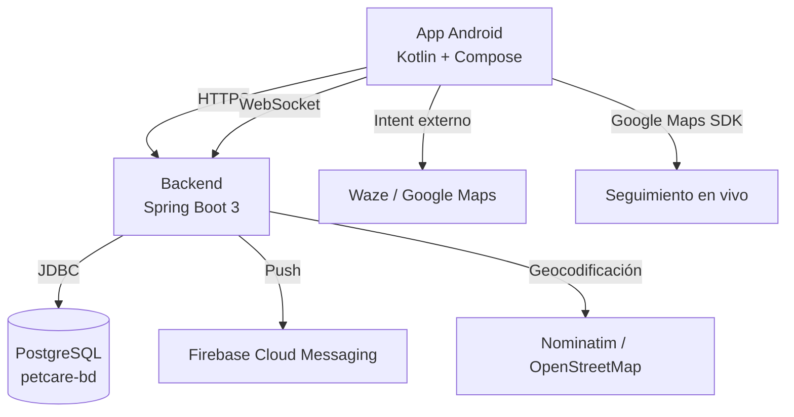
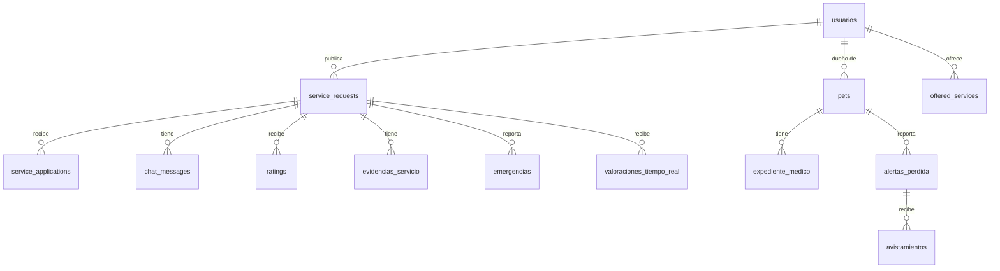

# Documentación Oficial — PetCare v2.0

## Tabla de contenido

1. [Introducción](#1-introducción)
2. [Guía de Usuario — Propietario](#2-guía-de-usuario--propietario)
3. [Guía de Usuario — Cuidador](#3-guía-de-usuario--cuidador)
4. [Guía de Usuario — Administrador](#4-guía-de-usuario--administrador)
5. [Cómo Funciona (Técnico)](#5-cómo-funciona-técnico)
6. [Modelo de Datos Detallado](#6-modelo-de-datos-detallado)
7. [Instalación y Configuración](#7-instalación-y-configuración)
8. [Convenciones de API](#8-convenciones-de-api)
9. [Seguridad](#9-seguridad)
10. [Funcionalidades Completas](#10-funcionalidades-completas)
11. [Restricciones de Usuario](#11-restricciones-de-usuario)
12. [Decisiones de Diseño](#12-decisiones-de-diseño)
13. [Estrategia de Testing](#13-estrategia-de-testing)
14. [Limitaciones Conocidas](#14-limitaciones-conocidas)
15. [Roadmap Futuro](#15-roadmap-futuro)
16. [Soporte y FAQ](#16-soporte-y-faq)
17. [Créditos y Licencia](#17-créditos-y-licencia)

---

## 1. Introducción

### ¿Qué es PetCare?

PetCare es una plataforma **exclusiva para el cuidado de perros** que conecta dueños de perros
con cuidadores de confianza en Nicaragua. No es una tienda ni un marketplace de venta de
animales — es, únicamente, un espacio para coordinar servicios de cuidado: paseos, guardería,
taxi canino, peluquería y visitas a domicilio.

### ¿Para qué sirve?

- Un **dueño** publica lo que su perro necesita (un paseo, unos días de guardería, un traslado)
  y recibe postulaciones de cuidadores cercanos, o busca directamente entre las ofertas ya
  publicadas.
- Un **cuidador** publica los servicios que ofrece, se postula a solicitudes abiertas, y
  gestiona sus servicios activos: chat, ubicación en vivo, fotos de evidencia, calificaciones.
- Un **administrador** supervisa la plataforma desde un panel con métricas generales.

### ¿Quién puede usarla?

Cualquier persona en Nicaragua con un perro que cuidar, o que quiera ofrecer sus servicios como
cuidador — sujeto a las tres reglas de negocio no negociables descritas en la
[sección 11](#11-restricciones-de-usuario): un usuario tiene un solo rol, los cuidadores no
registran mascotas propias, y no se permite vender animales en la plataforma.

---

## 2. Guía de Usuario — Propietario

1. **Registro**: correo y contraseña (`POST /api/auth/registro`). Se puede verificar el correo
   por OTP (`POST /api/auth/send-otp` / `verify-otp`) — sin SMTP configurado, el código se
   devuelve en la respuesta para pruebas.
2. **Elegir rol**: la primera vez que se abre la app, se elige "Soy dueño de perros" o
   "Quiero ser cuidador". Esta elección es permanente (ver Restricción 1).
3. **Registrar un perro**: nombre, raza, tamaño, edad, peso, descripción. Solo perros — no hay
   opción para registrar otras especies.
4. **Crear una solicitud de servicio**: elegir el perro, el tipo de servicio (paseo, guardería,
   taxi, peluquería, visitante, alojamiento), fecha/hora, ubicación y una descripción.
5. **Recibir postulaciones**: los cuidadores interesados se postulan; el dueño acepta la que
   prefiera (o busca entre ofertas publicadas y le pide directamente a un cuidador).
6. **Durante el servicio**: chat con fotos, botón de llamada directa, ubicación en vivo por
   mapa (paseo/taxi), botón "Cómo llegar" (Waze/Google Maps, guardería/veterinaria), botón de
   emergencia, reacciones rápidas (❤️/⭐/👍), evidencia fotográfica antes/después.
7. **Calificar**: al completar el servicio, calificación con estrellas y comentario.
8. **Expediente médico**: por cada perro, historial de vacunas, desparasitación, alergias,
   medicamentos, cirugías, peso y notas — con alertas cuando una vacuna está por vencer. El
   dueño es el único que puede agregar, editar o eliminar entradas; un cuidador solo puede
   consultarlo en modo lectura (ver sección 3, punto 8).
9. **Alerta de mascota perdida**: si un perro se pierde, botón "🚨 Mi perro se perdió" que
   notifica a usuarios cercanos (1/5/10 km) y permite recibir avistamientos.
10. **Calendario**: vista mensual/semanal de todos los servicios programados.

## 3. Guía de Usuario — Cuidador

1. **Registro y rol**: igual que el propietario, eligiendo "Quiero ser cuidador".
   **Un cuidador no puede registrar mascotas propias** (Restricción 2) — la app no muestra esa
   opción para este rol.
2. **Publicar disponibilidad/servicios**: tipo de servicio, precio, descripción, ubicación.
3. **Ver solicitudes abiertas**: buscar por cercanía o tipo de servicio, postularse.
4. **Aceptar/gestionar servicios**: chat con el dueño, marcar el servicio como iniciado
   (evidencia ANTES), y como terminado (evidencia DESPUÉS).
5. **Modo "no molestar"**: silenciar notificaciones push temporalmente.
6. **Badge**: etiqueta calculada automáticamente (NUEVO → EN_CRECIMIENTO → CONFIABLE →
   EXPERIMENTADO → ELITE, o EN_OBSERVACIÓN) según servicios completados, calificación promedio
   y cancelaciones — visible en el perfil y en las tarjetas de ofertas.
7. **Botón de emergencia**: reportar una emergencia durante un servicio activo.
8. **Expediente médico del perro (solo lectura)**: desde la tarjeta de una solicitud PENDIENTE
   (antes de ofertar), desde el detalle de un servicio ACCEPTED o ya COMPLETED, o desde la
   barra superior del chat — nunca puede agregar, editar ni eliminar entradas.

## 4. Guía de Usuario — Administrador

1. **Panel de administración**: `http://localhost:8080/admin/dashboard` — cards con usuarios
   totales, servicios completados, solicitudes activas y cuidadores activos; gráfico de
   actividad de los últimos 7 días; gráfico de usuarios por rol; tabla de las últimas 10
   solicitudes.
2. **Gestión de usuarios**: `GET/PUT/DELETE /api/users/{id}` (vía Swagger o llamadas directas
   a la API — no hay todavía una pantalla de administración de usuarios en el dashboard, ver
   [Limitaciones Conocidas](#14-limitaciones-conocidas)).
3. **Emergencias reportadas**: `GET /api/emergencias`.
4. **Documentación de la API**: Swagger UI en `/swagger-ui.html`.

## 5. Cómo Funciona (Técnico)

### Arquitectura



### Tecnologías

| Capa | Tecnología |
| --- | --- |
| Backend | Kotlin + Spring Boot 3.2.2 (Web, Data JPA, Security, WebSocket, Mail, Thymeleaf) |
| Base de datos | PostgreSQL 15+ |
| App móvil | Kotlin + Jetpack Compose, Navigation Compose (rutas type-safe), Retrofit + kotlinx.serialization, Room, Coil |
| Notificaciones | Firebase Cloud Messaging |
| Autenticación | JWT (`io.jsonwebtoken`), Spring Security (`SecurityFilterChain` + filtro JWT propio) |
| Documentación de API | springdoc-openapi (Swagger UI) |
| CI/CD | GitHub Actions (backend con Postgres de servicio, app Android con `assembleDebug`/tests) |

### Diagrama entidad-relación (resumen)



### Flujo de autenticación

1. `POST /api/auth/registro` (email + password) → crea el usuario con rol `gestor` sin
   confirmar, genera un JWT y una fila en `sesiones`.
2. `POST /api/users/{id}/roles` → confirma el rol elegido (propietario/cuidador). Una vez
   confirmado (`rol_confirmado = true`), no se puede cambiar.
3. `POST /api/auth/login` → valida credenciales, genera un nuevo JWT (con `jti` único).
4. Cada request subsiguiente lleva el JWT en `Authorization: Bearer <token>`; un filtro
   (`JwtAuthenticationFilter`) lo valida y puebla el `SecurityContext`.
5. La mayoría de endpoints de negocio (`/api/pets/**`, `/api/service-requests/**`, etc.) están
   en `permitAll()` a nivel de `SecurityFilterChain` (confían en el `usuario_id`/`owner_id` que
   manda el cliente, patrón usado en todo el proyecto); solo `/api/usuarios/me/**` y
   `/api/admin/**` exigen un JWT válido vía `authenticated()`/`@PreAuthorize("isAuthenticated()")`.

### Endpoints principales

Ver [`README.md`](../README.md#endpoints-principales) del backend para la lista agrupada por
área, o Swagger UI (`/swagger-ui.html`) para la referencia completa y siempre actualizada.

---

## 6. Modelo de Datos Detallado

Resumen de las entidades principales (tabla, campos clave y propósito). La fuente de verdad es
siempre `src/main/kotlin/com/petcare/model/` en `petcare-services` y `petcare-bd/database/schema.sql`.

| Entidad (tabla) | Campos principales | Propósito |
| --- | --- | --- |
| `usuarios` | `id`, `email`, `password_hash`, `rol` (`gestor`\*/`propietario`/`administrador`), `rol_confirmado`, `nombre`, `telefono`, `latitud`/`longitud`, `badge`, `no_molestar`, `fcm_token` | Cuenta de usuario, rol y ubicación |
| `pets` | `id`, `owner_id`, `name`, `breed`, `size`, `age`, `weight`, `description` | Perro registrado por un propietario |
| `service_requests` | `id`, `owner_id`, `pet_id`, `service_type_id`, `title`, `status`, `source_type` (`OPEN`/desde oferta), `requested_date`, `motivo_cancelacion` | Solicitud de servicio creada por el propietario |
| `offered_services` | `id`, `caregiver_id`, `service_type_id`, `price`, `is_available`, `latitude`/`longitude` | Servicio publicado por un cuidador |
| `service_applications` | `id`, `service_request_id`, `caregiver_id`, `offered_service_id`, `initiated_by`, `status` | Postulación de un cuidador a una solicitud (o viceversa) |
| `ratings` | `id`, `service_request_id`, `caregiver_id`, `owner_id`, `rated_by_role`, `score` (0.5–5.0), `comment`, `respuesta_calificacion` | Calificación con estrellas al completar un servicio |
| `expediente_medico` | `id`, `pets_id`, `tipo`, `titulo`, `fecha`, `fecha_proxima`, `veterinario_nombre`/`telefono`, `imagen_carnet_url` | Entrada del historial médico de un perro |
| `alertas_perdida` | `id`, `pets_id`, `usuario_id`, `latitud`/`longitud`, `estado` (`ACTIVA`/cerrada), `fecha_cierre` | Alerta de mascota perdida |
| `avistamientos` | (asociada a `alertas_perdida`) | Avistamiento reportado por un usuario cercano a una alerta activa |
| `evidencias_servicio` | `id`, `solicitud_id`, `tipo` (`ANTES`/`DESPUES`), `imagen_url`, `latitud`/`longitud` | Foto obligatoria de evidencia de un servicio |
| `emergencias` | asociada a `service_requests` | Emergencia reportada durante un servicio activo |
| `chat_messages` | asociada a `service_requests` | Mensajes del chat interno de una solicitud |

\* `gestor` es el valor de rol usado tanto para "cuidador" como para el estado transitorio
"sin rol confirmado todavía" (ver el flujo de autenticación en la sección 5) — es un detalle
histórico de la base de datos, no dos roles distintos.

**Nota:** el "badge" del cuidador es una columna calculada (`usuarios.badge`) mantenida por
`BadgeService`, no una tabla aparte. La "disponibilidad del cuidador" (horario propio) todavía
no existe como entidad — ver [Limitaciones Conocidas](#14-limitaciones-conocidas).

---

## 7. Instalación y Configuración

### Requisitos previos

- JDK 17
- PostgreSQL 15+ corriendo localmente (o accesible por red)
- Android Studio (Koala o más reciente) para la app móvil
- Gradle Wrapper (incluido en ambos repos, no requiere instalación aparte)

### 1. Clonar los repositorios

```bash
git clone git@github.com:VanessaA1A/petcare-bd.git
git clone git@github.com:VanessaA1A/petcare-services.git
git clone git@github.com:Kxfuentes/PetCareApp.git
```

### 2. Base de datos

El nombre de base de datos usado por `.env.example` es `PetCareBD` (si se prefiere otro nombre,
ajustar `DB_NAME` en `.env` para que coincida):

```bash
psql -U postgres -c "CREATE DATABASE \"PetCareBD\";"
psql -U postgres -d PetCareBD -f petcare-bd/database/schema.sql
psql -U postgres -d PetCareBD -f petcare-bd/database/seeds/seeds_demo.sql   # datos de demo (opcional)
```

### 3. Backend

```bash
cd petcare-services
cp .env.example .env   # ajustar DB_PASSWORD, JWT_SECRET
./gradlew bootRun
```

La API queda en `http://localhost:8080`. Swagger en `http://localhost:8080/swagger-ui.html`,
panel de admin en `http://localhost:8080/admin/dashboard`.

### 4. App Android

```bash
cd PetCareApp
cp secrets.properties.example secrets.properties
```

Abrir en Android Studio, sincronizar Gradle, ejecutar en un emulador o dispositivo. Por defecto
`BASE_URL` apunta a `http://10.0.2.2:8080/` (el backend en `localhost` visto desde el
emulador).

### 5. Google Maps API Key (opcional)

El mapa de seguimiento en vivo funciona sin API key (con el watermark "for development purposes
only"). Para una key real, ver
[`PetCareApp/GOOGLE_MAPS_SETUP.md`](../../PetCareApp/GOOGLE_MAPS_SETUP.md).

---

## 8. Convenciones de API

- **Formato de respuesta exitosa**: la mayoría de endpoints devuelven el recurso directamente
  como JSON (por ejemplo `ExpedienteMedicoDTO`, `Pet`, una lista `[...]`), sin un sobre
  `{ "data": ... }`. Revisar Swagger UI (`/swagger-ui.html`) endpoint por endpoint para el
  cuerpo exacto, ya que no hay un envoltorio único en todo el proyecto.
- **Formato de error**: `{ "error": "mensaje descriptivo" }` en la gran mayoría de
  controladores.
- **Códigos HTTP usados**: `200` (OK), `201` (creado), `204` (eliminado sin contenido), `400`
  (validación fallida), `403` (no autorizado para esa acción, p. ej. Restricción 2), `404`
  (recurso no encontrado), `500` (error no controlado).
- **Autenticación**: header `Authorization: Bearer <JWT>` — obligatorio solo en
  `/api/usuarios/me/**` y `/api/admin/**`; el resto de endpoints de negocio confían en el
  `usuario_id`/`owner_id` enviado en el cuerpo o query string (ver sección 5, Flujo de
  autenticación, y la sección 9 de Seguridad para las implicaciones).
- **Ejemplo — verificar si un correo ya tiene rol asignado**:

  ```bash
  curl "http://localhost:8080/api/usuarios/verificar-rol?email=dueno@example.com"
  # → { "existe": true, "rolConfirmado": true, "rol": "propietario" }
  ```

---

## 9. Seguridad

- **JWT**: firmado con HMAC-SHA256, expira a los 7 días (`JWT_EXPIRATION_MS`, por defecto
  `604800000` ms). Incluye un `jti` único por token. El secreto (`JWT_SECRET`) debe tener al
  menos 32 caracteres o el backend rehúsa arrancar.
- **Contraseñas**: hasheadas con `BCryptPasswordEncoder` (Spring Security), nunca en texto
  plano ni expuestas en las respuestas de la API (`@JsonIgnore` en `password_hash`).
- **CORS**: abierto a cualquier origen (`allowedOrigins("*")`, sin credenciales) — apropiado
  para un backend consumido por una app móvil nativa, pero a revisar antes de exponer la API a
  un frontend web en producción.
- **Autorización por endpoint**: como se explica en la sección 5, la mayoría de rutas de
  negocio son `permitAll()` a nivel de Spring Security y validan el `usuario_id` recibido
  dentro de cada controlador/servicio (no hay `hasRole()`/`hasAuthority()` en el proyecto);
  solo `/api/usuarios/me/**` y `/api/admin/**` exigen un JWT válido. Esto es una decisión de
  diseño para simplificar la integración con la app durante el desarrollo, no un estado final
  recomendado para producción pública.
- **Rate limiting**: no implementado todavía — no hay ningún interceptor o librería
  (Bucket4j, etc.) limitando peticiones por IP/usuario. Es una tarea pendiente antes de un
  despliegue público (ver [Limitaciones Conocidas](#14-limitaciones-conocidas)).
- **Validaciones**: se aplican tanto en el backend (por ejemplo, tipos de expediente médico
  válidos, palabras clave de venta prohibidas — Restricción 3) como en la app (formularios que
  no permiten enviar campos vacíos o inválidos antes de llamar a la API).

---

## 10. Funcionalidades Completas

- Autenticación (registro, login, recuperación de contraseña, verificación OTP por correo)
- Roles: propietario / cuidador / administrador
- Gestión de perros (alta, edición, borrado, expediente médico)
- Solicitudes de servicio (creación, edición, cancelación, reasignación, historial, búsqueda)
- Servicios ofrecidos por cuidadores
- Postulaciones (aceptar/rechazar)
- Chat interno con fotos y confirmación de lectura
- Notificaciones push (Firebase Cloud Messaging) y en tiempo real (WebSocket)
- Geolocalización: búsqueda por cercanía, geocodificación (Nominatim), seguimiento en vivo por
  mapa, botón "Cómo llegar"
- Calificaciones con estrellas y comentario
- Badges por calificación (6 niveles)
- Botón de emergencia
- Compartir solicitud (deep link)
- Valoración en tiempo real (reacciones rápidas)
- Foto obligatoria antes/después de un servicio (con cola offline)
- Calendario integrado (vista mensual y semanal)
- Llamadas telefónicas directas
- Expediente médico con alertas de vacunas próximas, visible en modo lectura para el cuidador
  antes de ofertar (solicitud PENDIENTE), y durante/después de un servicio aceptado
- Alerta de mascota perdida con avistamientos y notificación por proximidad
- Modo "no molestar"
- Modo oscuro, soporte para inglés, accesibilidad (WCAG AA), caché offline del chat
- Panel de administración con métricas y gráficos
- Tests de integración (backend contra PostgreSQL real) y de red (Android con MockWebServer)
- CI/CD con GitHub Actions en ambos repos

---

## 11. Restricciones de Usuario

Estas tres reglas de negocio son **no negociables** y están implementadas tanto en el backend
como en la app:

### Restricción 1 — No se puede ser propietario y cuidador a la vez

Cada usuario elige un rol una sola vez. `GET /api/usuarios/verificar-rol?email=` permite
comprobarlo antes de tiempo; `POST /api/users/{id}/roles` rechaza con 400 cualquier intento de
cambiar a un rol distinto una vez confirmado. En la app, un ícono ⋮ en la pantalla de selección
de rol explica el porqué.

**Justificación**: evitar conflictos de interés y garantizar atención exclusiva a los perros.

### Restricción 2 — Los cuidadores no pueden tener mascotas

`POST /api/pets` y `POST /api/pets/bulk` devuelven 403 si el `owner_id` pertenece a un usuario
con rol cuidador. En la app, el botón de registrar mascota solo existe en las pantallas del
propietario, a las que un cuidador nunca navega.

**Justificación**: evitar que un cuidador priorice sus propios perros sobre los de sus
clientes; garantizar dedicación exclusiva.

### Restricción 3 — No se permite venta de animales

`POST /api/service-requests` y `POST /api/offered-services` rechazan con 400 cualquier título o
descripción que contenga palabras clave de venta ("venta", "vender", "comprar perro", "precio
de venta", etc.). `GET /api/reglas/etica` devuelve el texto completo de la regla. En la app, una
nota visible en las pantallas de creación lo recuerda.

**Justificación**: bienestar animal, prevención del maltrato, y lucha contra el tráfico ilegal
de especies (ver estudios de la UICN y TRAFFIC sobre comercio ilegal de fauna en Centroamérica).

---

## 12. Decisiones de Diseño

- **¿Por qué PetCare es solo para perros?** Enfocar el producto en una sola especie simplifica
  el alcance (razas, tamaños, necesidades de cuidado) para un proyecto académico, y evita la
  complejidad de reglas de negocio distintas por especie (p. ej. requisitos veterinarios muy
  distintos entre perros, gatos y otras mascotas).
- **¿Por qué Spring Boot y no Node.js?** Tipado fuerte (Kotlin), un ecosistema maduro para
  JPA/Hibernate + PostgreSQL, Spring Security con JWT ya integrado, y springdoc-openapi para
  documentación automática — reduce la superficie de bugs de un proyecto grande frente a un
  stack JS sin tipos.
- **¿Por qué Jetpack Compose y no XML?** Es el toolkit de UI recomendado por Google desde 2021;
  permite construir pantallas complejas (diálogos, tabs, listas con estado) con mucho menos
  código repetitivo que XML + View Binding, y su modelo de estado declarativo encaja bien con
  Kotlin Flows/StateFlow.
- **¿Por qué PostgreSQL y no MongoDB?** El dominio (usuarios, mascotas, solicitudes,
  postulaciones, calificaciones) es fuertemente relacional, con muchas relaciones 1:N y N:N
  (favoritos, postulaciones) donde la integridad referencial (FKs, constraints) importa más que
  la flexibilidad de esquema de un documento.
- **¿Por qué JWT y no sesiones?** El backend es *stateless* (`SessionCreationPolicy.STATELESS`)
  para poder escalar horizontalmente sin pegajosidad de sesión, y porque el cliente (app móvil)
  no maneja cookies de forma nativa tan cómodamente como un header `Authorization`.
- **¿Por qué Room y no SQLite directo?** Room da mapeo objeto-relacional type-safe, migraciones
  versionadas explícitas, y integración directa con Kotlin coroutines/Flow — evita escribir SQL
  manual propenso a errores para el caché offline (mensajes de chat, evidencia pendiente de
  subir).

---

## 13. Estrategia de Testing

- **Backend — tests unitarios**: JUnit 5 + Mockito para servicios aislados (por ejemplo
  `RatingServiceTest`, `GeocodingServiceTest`, `OtpServiceTest`, `RoleUtilTest`) en
  `petcare-services/src/test/kotlin`.
  Nota: aun no hay tests unitarios propios para servicios de reglas más nuevas del proyecto
  (por ejemplo, `BadgeService`); son un buen próximo candidato a cubrir.
- **Backend — tests de integración**: `IntegrationTest.kt` corre contra una base de datos
  PostgreSQL real (no una base mockeada ni H2), la misma estrategia que usa el CI
  (`postgres:15` como servicio de GitHub Actions, base `petcare_test`) — para atrapar bugs
  reales de constraints/columnas que un mock no vería (ver el comentario sobre el bug del rol
  `"cliente"` en `AuthController.kt`).
- **Android**: tests de la capa de red con MockWebServer (`app/src/test`), para verificar el
  parseo de respuestas y el manejo de errores de `ApiService` sin depender de un backend real
  levantado.
- **CI/CD**: GitHub Actions en ambos repositorios (`petcare-services/.github/workflows/build.yml`,
  `PetCareApp/.github/workflows/build.yml`) — el backend compila y corre las pruebas contra
  Postgres de servicio en cada push/PR a `main`; la app Android compila (`assembleDebug`) y
  corre sus pruebas unitarias.

---

## 14. Limitaciones Conocidas

- Sin pasarela de pagos ni monetización (fuera de alcance, excluido explícitamente).
- Sin organizaciones (veterinarias/tiendas/adopción) — solo usuarios individuales.
- Docker no se usa en desarrollo local en este entorno (ver notas de cada repo); el CI de
  GitHub Actions sí usa PostgreSQL como servicio en contenedor.
- El panel de administración (`/admin/dashboard`) es de solo lectura y no tiene su propio login
  — los endpoints `/api/admin/**` están abiertos (`permitAll`). Antes de un despliegue público
  real, hay que agregar autenticación de administrador dedicada.
- La "disponibilidad" del calendario (`GET /api/calendario`) siempre devuelve una lista vacía —
  el backend no tiene todavía un concepto de horario de disponibilidad del cuidador.
- No hay rate limiting en la API (ver sección 9, Seguridad) — pendiente antes de exponerla
  públicamente sin un proxy/gateway que lo aplique.
- No existe un flujo dedicado para que un cuidador o propietario reporte que la otra parte "no
  se presentó" a un servicio agendado; hoy la única vía es cancelar la solicitud y, si aplica,
  reportar una emergencia o dejarlo reflejado en la calificación.
- Los avistamientos de mascota perdida no soportan adjuntar foto directamente desde la app
  (el endpoint espera una URL, no un upload multipart).
- La API Key real de Google Maps no está configurada — el mapa funciona pero muestra el
  watermark de desarrollo hasta que se configure una key real.
- No hay reintentos de CI verificados en vivo en este entorno (sin acceso a `gh` CLI durante el
  desarrollo) — los comandos equivalentes se verificaron localmente contra una base de datos
  real, pero la primera ejecución real en GitHub Actions debe revisarse.

---

## 15. Roadmap Futuro

- Pasarela de pagos (p. ej. Stripe) para servicios pagados dentro de la app.
- Organizaciones (veterinarias, tiendas, refugios/adopción) como un tipo de cuenta aparte.
- Videollamadas para verificar el estado de la mascota en tiempo real.
- Sincronización del calendario con Google Calendar / Apple Calendar.
- Horarios de disponibilidad reales del cuidador (calendario propio, no solo servicios
  agendados).
- Evaluar expansión a otras especies (gatos, aves, etc.) si el enfoque exclusivo en perros deja
  de ser una ventaja competitiva.
- Panel de administración con gestión completa de usuarios (no solo lectura) y autenticación
  dedicada.
- Adjuntar fotos directamente a los avistamientos de mascota perdida.
- Rate limiting y hardening general de la API antes de un despliegue público.

---

## 16. Soporte y FAQ

**¿Cómo cambio de rol si me equivoqué?** No se puede cambiar de rol una vez confirmado
(Restricción 1) — contacta a soporte.

**¿Puedo registrar un gato u otra mascota?** No, PetCare es exclusivamente para perros.

**¿Por qué no veo el botón de registrar mascota?** Los cuidadores no pueden registrar mascotas
propias (Restricción 2) — si necesitas registrar una mascota, tu cuenta debe ser de propietario.

**¿Puedo vender o regalar un perro en la plataforma?** No, está explícitamente prohibido
(Restricción 3) y el sistema rechaza automáticamente cualquier publicación con ese tipo de
lenguaje.

**El mapa se ve con una marca de agua ("for development purposes only")** — es el comportamiento
esperado sin una API Key real de Google Maps configurada; ver
[`GOOGLE_MAPS_SETUP.md`](../../PetCareApp/GOOGLE_MAPS_SETUP.md).

**¿Cómo funciona el sistema de badges?** Es una etiqueta calculada automáticamente para cada
cuidador (`usuarios.badge`) según servicios completados, calificación promedio y cancelaciones:
NUEVO → EN_CRECIMIENTO → CONFIABLE → EXPERIMENTADO → ELITE, o EN_OBSERVACIÓN si el historial
reciente es problemático. Se recalcula tras cada servicio completado o calificado.

**¿Qué pasa si el cuidador (o el dueño) no se presenta?** Hoy no hay un flujo automático de
"no-show" (ver [Limitaciones Conocidas](#14-limitaciones-conocidas)): la recomendación actual es
cancelar la solicitud desde la app y, si corresponde, reflejarlo en la calificación o reportarlo
como emergencia si ocurrió durante un servicio ya iniciado.

**¿Cómo se manejan las cancelaciones?** Una solicitud o postulación se puede cancelar mientras
no esté completada (`PUT /api/service-requests/{id}/status` o
`POST /api/ofertas/{id}/cancelar`), guardando opcionalmente un motivo (`motivo_cancelacion`).
Cancelaciones frecuentes afectan negativamente el badge del cuidador.

**¿Los datos están seguros?** Las contraseñas se guardan hasheadas con BCrypt (nunca en texto
plano), la sesión se maneja con JWT firmado y expira a los 7 días. La API todavía no tiene rate
limiting propio ni la mayoría de sus endpoints exige JWT (ver la sección 9, Seguridad) — es un
proyecto académico en desarrollo activo, no un backend con hardening de producción completo.

**¿Cómo contacto a soporte?** Abriendo un issue en el repositorio correspondiente
(`petcare-services`, `PetCareApp` o `petcare-bd`) en GitHub — no hay todavía un canal de soporte
en vivo dentro de la app.

**¿Dónde reporto un bug?** Abre un issue en el repositorio correspondiente
(`petcare-services`, `PetCareApp` o `petcare-bd`) en GitHub.

---

## 17. Créditos y Licencia

### Autores

Proyecto desarrollado como trabajo académico por:

- Vanessa (`VanessaA1A`)
- Kelly Fuentes (`Kxfuentes` / `KellyFuentes`)
- Olman Avila (`OlmanAvilaBairesDev`)
- Cori Areas
- Colaboradores adicionales — ver el historial de commits de cada repositorio
  (`petcare-services`, `PetCareApp`, `petcare-bd`) para la lista completa y actualizada.

### Licencia

Ninguno de los tres repositorios publica todavía un archivo `LICENSE`. Hasta que se agregue uno
explícito, el código debe tratarse como uso privado/académico — no está autorizado su
redistribución ni uso comercial sin acuerdo previo con los autores.
